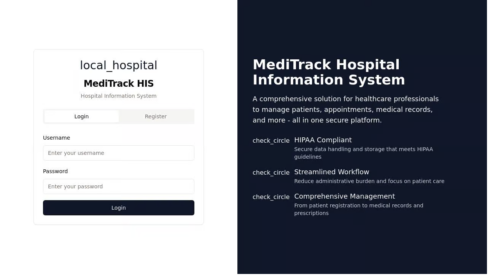

# MediTrack Hospital Information System

A comprehensive Hospital Information System (HIS) for managing patients, appointments, medical records, and staff.

## Features

- **User Authentication & Authorization**
  - Secure login and registration
  - Role-based access control

- **Patient Management**
  - Patient registration and profile management
  - Medical history tracking
  - Search and filter functionality

- **Appointment Scheduling**
  - Appointment creation and management
  - Calendar view with status indicators

- **Medical Records**
  - Digital medical record creation and management
  - Diagnosis and treatment tracking

- **Prescription Management**
  - Digital prescription creation
  - Medication tracking

- **Department Management**
  - Department creation and oversight
  - Staff allocation

- **Staff Management**
  - Staff registration and profile management
  - Role assignment

- **Reports & Analytics**
  - Patient statistics
  - Appointment analytics
  - Department performance metrics

## Tech Stack

- **Frontend**: React with TypeScript, TanStack Query, Wouter, React Hook Form, Tailwind CSS
- **Backend**: Node.js with Express, TypeScript, Passport.js
- **Data Storage**: In-memory storage with Drizzle ORM schema and Zod validation

## Getting Started

### Prerequisites

- Node.js (v18+)
- npm or yarn

### Installation

1. Clone the repository
2. Install dependencies
3. Start the development server
4. Open your browser and navigate to the application URL

## Usage

### Initial Login

Register a new account using the registration form.

### User Roles

- **Doctor**: Can view and manage patients, appointments, medical records, and prescriptions
- **Nurse**: Can view patients, appointments, and medical records
- **Receptionist**: Can manage patients and appointments
- **Administrator**: Has full access to all features

## License

MIT
